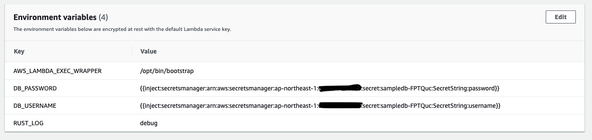

# secret-injection-demo

This is a hello world sample python application created with AWS SAM CLI to demonstrate lambda secret injector.  

## Setup

1. Install AWS CLI, SAM CLI and docker. 
2. Create a secret in AWS Secret Manager. Add two key/value pairs, e.g. `{"username":"admin","password":"1qaz2wsx#EDC"}`
3. Take note of the secret ARN
4. Add two environment variables for these two secrets. Checkout the SAM [Template file](template.yaml) for example. 
```bash 
  DB_USERNAME: !Sub "{{inject:secretsmanager:${SecretArn}:SecretString:username}}"
  DB_PASSWORD: !Sub "{{inject:secretsmanager:${SecretArn}:SecretString:password}}"
```
5. Add a layer with secrets injector and a wrapper script. Checkout the SAM [Template file](template.yaml) for example.
6. In the lambda handler, these environment variables are updated with secret values. And you can use the directly in your code. 
```python 
    return {
        "statusCode": 200,
        "body": json.dumps({
            "DB_USERNAME": os.getenv("DB_USERNAME"),
            "DB_PASSWORD": os.getenv("DB_PASSWORD"),
        }),
    }
```

## Build and Deploy 

```bash
sam build --use-container
sam deploy --guided
```
Provide the secret ARN when SAM CLI asks for Parameter SecretArn.  

## Test

When the deployment completes, curl the HelloWorldApi's url in the output. You should see the secrets' values. 

```bash
% curl https://xxxxxxxx.execute-api.ap-northeast-1.amazonaws.com/Prod/   
{"DB_USERNAME": "admin", "DB_PASSWORD": "1qaz2wsx#EDC"}
```

And on Lambda environment variable page, the secrets' values are not exposed. 



## Debug

Add a new Lambda environment variable: `RUST_LOG=debug`. This will enable debug logging for the tool. 


## Wrapper script

Checkout the wrapper script to see how things are wired together. For more details about wrapper script, please read Lambda documentation [here](https://docs.aws.amazon.com/lambda/latest/dg/runtimes-modify.html#runtime-wrapper). 